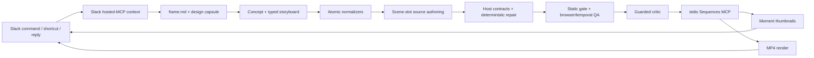

# Sequences for Slack — current state and roadmap

> Slack Agent Builder Challenge · deadline July 13, 2026 at 8pm EDT.
> Working rules: [CLAUDE.md](CLAUDE.md) · operations:
> [OPERATIONS.md](OPERATIONS.md) · correctness/fallbacks:
> [SENTINEL.md](SENTINEL.md) · historical ledger:
> [docs/history/CHANGELOG.md](docs/history/CHANGELOG.md).

## Product

Sequences turns a Slack release thread into an on-brand launch film. A user can
create from `/sequences` or a message shortcut, inspect moment-led thumbnails,
receive the MP4 asynchronously, revise conversationally, undo, render HD, and
approve/share without leaving Slack.

HyperFrames is the authoring/rendering substrate. Sequences contributes the
Slack workflow and deterministic film system: typed planning, host-owned
runtime contracts, source normalization, static/browser QA, checkpoints,
replay, and resilient two-tier delivery.

## Shipped architecture

The host owns the document chassis, scene stack, timeline registration,
playback/seek semantics, runtime islands, and local asset staging. The model
authors the creative scene interiors inside the committed frame system. Every
mechanical obligation belongs to the lowest Sentinel layer that can own it.

## Capability map

| Capability | Primary owner | Current behavior |
| --- | --- | --- |
| Slack create/revise/undo/share and two-tier delivery | `src/index.ts`, `src/orchestrator.ts` | Thumbnails first, MP4 async; MCP-first with equivalent in-process resilience |
| Slack workspace evidence | `src/slackMcpContext.ts` | OpenAI Responses + invoking-user OAuth against Slack-hosted MCP |
| Direct planning/authoring ladder | `src/engine/compositionRunner.ts` | Concept → typed storyboard → scene slots → native-image critic (strip + blocking sheet, ≤5 directives) under full non-regression QA; persisted attempts and recovery rungs |
| Canonical source/checkpoints/render | `src/engine/directComposition.ts`, `render.ts` | Direct HyperFrames validation, replay, undo, preview, draft/HD render |
| Correctness ownership | `src/engine/sentinel.ts`, `SENTINEL.md` | Closed-world finding registry, L0–L5 placement, degradation/cost telemetry |
| Host-contract metadata | `src/engine/hostContract.ts` | Shared adapters for interaction, cut, camera, continuity, component, time, FX, asset, environment; runner still owns order |
| Feature/environment inventory | `src/engine/featureFlags.ts` | Every source-read `SLACK_SEQUENCES_*` input classified with owner/default/values/rollback; closed-world source scan |
| Frame/brand/cinematography | `frameDesign.ts`, `frameTools.ts`, `cinemaKit.ts` | Curated embedded type, semantic tokens, contrast/font repair, host lighting/grain/material/grade kit |
| Environments/living canvas | `environmentContract.ts`, `backgroundCatalog.ts`, `sequences-environment.v1.*` | Default-on deterministic wallpaper/field staging; one MIT wallpaper + license per film; ambient imagery/furniture/light stays off primary text |
| Continuity + camera blocking | `continuityGraph.ts`, `cameraBlocking.ts`, camera/continuity runtimes | Default-on entity continuity, measured shared handoffs, graph-owned minimum-jerk primary routes and dwell/occupancy evidence (`=0` rollback) |
| Cuts and transition causality | `cutContract.ts`, `cutDiscovery.ts`, cuts runtime | Host-owned boundary windows, measured bridge safety, outgoing lead/evidence, up to two discovered matches only when the second has shared identity |
| Component choreography | `componentContract.ts`, components runtime | Typed beats/morphs, follows/lag chains, one entrance family per scene, directional exits, settle bloom |
| Plugins | `pluginContract.ts`, `pluginKernel.ts`, `seedContent.ts` | Seeded host generators including topology, comparison, and pricing set-pieces, lowered to ordinary components/beats |
| Assets | `assetContract.ts`, `assetRuntime.ts`, `src/engine/assets/` | Thirteen typed parametric assets with finite spring motion; `/sequences asset` brand intake; Studio viewer |
| Recipes + Studio | `recipeContract.ts`, `recipes/`, `studio/` | Proven fragments injected verbatim; high-confidence default-safe auto-declaration; local components/assets/recipes viewer and gate/export UI |
| Spatial/browser QA | `layoutInspector.ts` | Safe area, clipping, interaction geometry, eye trace, 24×14 sparse framing, 32×18 composition floor, washout, outgoing-transition truth |
| Direction/continuous evidence | `directionScore.ts`, `continuousMotion.ts`, `temporalInspector.ts` | Phrase ownership plus focal/velocity/jerk/reversal/settle/competition/dead-frame evidence and blocking/contact strips |
| Test topology | `vitest.config.ts`, `package.json` | Fast `test:unit`, explicit `test:browser`, combined `test` before commits/probes |

## Motion-quality closeout

The implementation in [MOTION_QUALITY_PLAN.md](MOTION_QUALITY_PLAN.md) has
landed the main mechanical and host-owned work:

- occupancy-grid framing and measured motion-quality thresholds;
- station-size correction, host environments, and whole-frame composition;
- living ambient motion, component settle blooms, and rendered dead-frame
  evidence;
- follow chains, scene entrance families, directional exits, and outgoing
  transition motion/evidence;
- washout/display-type discipline and semantic topology/comparison/pricing
  plugins;
- high-confidence recipe auto-declaration, shared host-contract metadata,
  feature-flag inventory, and split unit/browser suites;
- a native vision-critic seam over bounded strip/blocking PNG evidence, with a
  kill switch and pre-critique fallback; and three green-gated/exported craft
  recipes for ambient hero staging, overlapping dashboard entrances, and an
  outgoing morph seam.

The work is not accepted until the exact local ladder is green and one fresh
paid rendered probe is watched. A probe that burns an avoidable attempt stops
the run: fix the class with the Sentinel placement tree, add the regression,
record it in `PROBE_LOG.md`, then continue. Success means a clean authored
publish (not fallback and preferably not `published-degraded`), at most two
source attempts, no under-composed frame, no >1.5s dead window outside a typed
hold, visible outgoing motion for declared morphs, coherent scene entrance
grammar, and clear tonal hierarchy.

## Active work

### Required before calling the motion-quality plan complete

- [ ] Complete the ordered normalizer-registry migration (WS-F1). The contiguous
  safe source-repair prefix already runs through a telemetry-owning registry and
  has a golden order/idempotence replay; migrate the remaining contract-coupled
  stages only in behavior-preserving groups until execution and Sentinel
  conformance derive from the full list.
- [ ] Split the remaining `compositionRunner.ts` concerns into `runner/`
  modules with move-only, behavior-preserving changes (WS-F2). Do this only on
  a quiet tree; preserve the barrel API and run the complete unit/browser
  suite after each extraction.
- [ ] Run the full local source/browser/render ladder, then exactly one fresh
  paid `sequence:check --render` probe authorized by the plan. Inspect the MP4,
  `strip.png`, `blocking.png`, thumbnails, temporal JSON, attempt ledger, and
  disposition. Fix any newly exposed mechanical class before another probe.
- [ ] Archive resolved entries from `PROBE_FEEDBACK.md` only after the new
  implementation has fixed and logged their class; leave genuine taste-tail
  observations live.

### Product work after the closeout

- [ ] Materialize registry-approved capabilities instead of rebuilding them
  from metadata, then offer in-Slack audition.
- [ ] Extend component contracts to source-derived non-kit parts/states/anchors.
- [ ] Add sound/edit cues and mix them in the render pass after the visual
  delivery path is stable.
- [ ] Add more diverse proven films/recipes (developer tool, startup vision,
  rebrand) and promote approved work into retrieval.

## Parked risks

These need evidence or a real design, not more prompt prose:

- Position-less sequential GSAP tweens can still evade static placement
  reasoning; a safe fix needs a sequence simulator in `motionDensity`.
- A compact patch can occasionally delete an unrelated binding. The existing
  never-delete warning, slot/full-document escalation, and ladder recovery
  contain it; ambiguity stays blocking.
- Shared frame caching cannot distinguish an accidental retry from a deliberate
  creative retake. Do not cache the frame across job ids without deciding that
  product semantic.
- Rendered/taste-tail judgments—semantic graphic truth, intentional clipping
  versus accident, hierarchy, and motivated color shifts—belong to bounded
  visual review under deterministic non-regression QA.

## Operating constraints

- Do not raise attempt counts, loosen gates, or change prompts/reasoning/QA
  thresholds as a cost lever.
- `SLACK_SEQUENCES_ALLOW_DETERMINISTIC_FALLBACK=0` is useful during prep; set it
  to `1` or unset it on Railway before judging.
- Every engine/runtime/schema/injection seam change must update
  `studio/INTEGRATION.md` and re-prove affected recipes.
- Job directories are immutable; use a fresh job id for a fresh paid probe.
- The source tree and registries are authoritative. Historical plans/reports in
  `docs/history/` explain why, not what remains to do.
